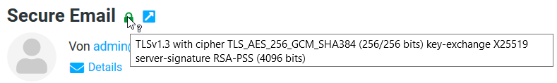

# Roundcube TLS Icon

Displays a small icon after the subject line that displays the (presumed) encryption state of received mails.
This plugin parses the "Received" header for the last hop and checks if TLS was used. This requires TLS logging in the receiving MTA.

In Postfix this can be enabled by setting [`smtpd_tls_received_header = yes`](https://www.postfix.org/postconf.5.html#smtpd_tls_received_header). The regex used to parse the header has only been tested against Postfix.

Note that while this talks about "encryption", this does not imply security. An encrypted mail may still be insecure, mostly because mailservers generally use  "opportunistic TLS", where MITM attacks are possible.
This also only validates the last hop of an email - some emails may run through multiple hops and we don't know anything about the security of these.

Inspired by [roundcube-easy-unsubscribe](https://github.com/SS88UK/roundcube-easy-unsubscribe)

## Installation

The [composer library](https://packagist.org/packages/germancoding/tls_icon) name is: `germancoding/tls_icon`.

The plugin name to add to your config file is: `tls_icon`.
